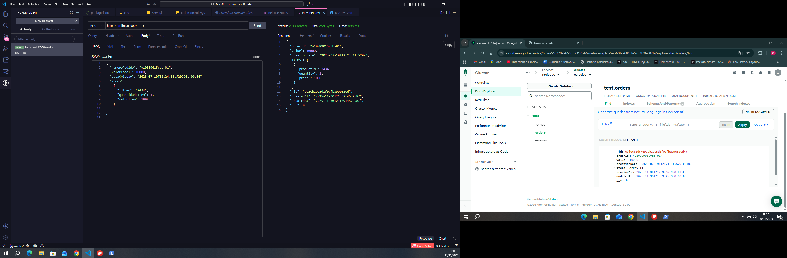

# Order API (Node.js + Express + MongoDB)

API simples para gerenciar pedidos (CRUD) com mapeamento do JSON de entrada para o formato de armazenamento.

## Endpoints

- `POST /order` - Criar um novo pedido (obrigatório)
- `GET /order/:id` - Obter pedido por orderId (obrigatório)
- `GET /order/list` - Listar todos os pedidos (opcional)
- `PUT /order/:id` - Atualizar pedido por orderId (opcional)
- `DELETE /order/:id` - Deletar pedido por orderId (opcional)

### Formato de entrada (exemplo)
```json
{
  "numeroPedido": "v10089015vdb-01",
  "valorTotal": 10000,
  "dataCriacao": "2023-07-19T12:24:11.5299601+00:00",
  "items": [
    {
      "idItem": "2434",
      "quantidadeItem": 1,
      "valorItem": 1000
    }
  ]
}



